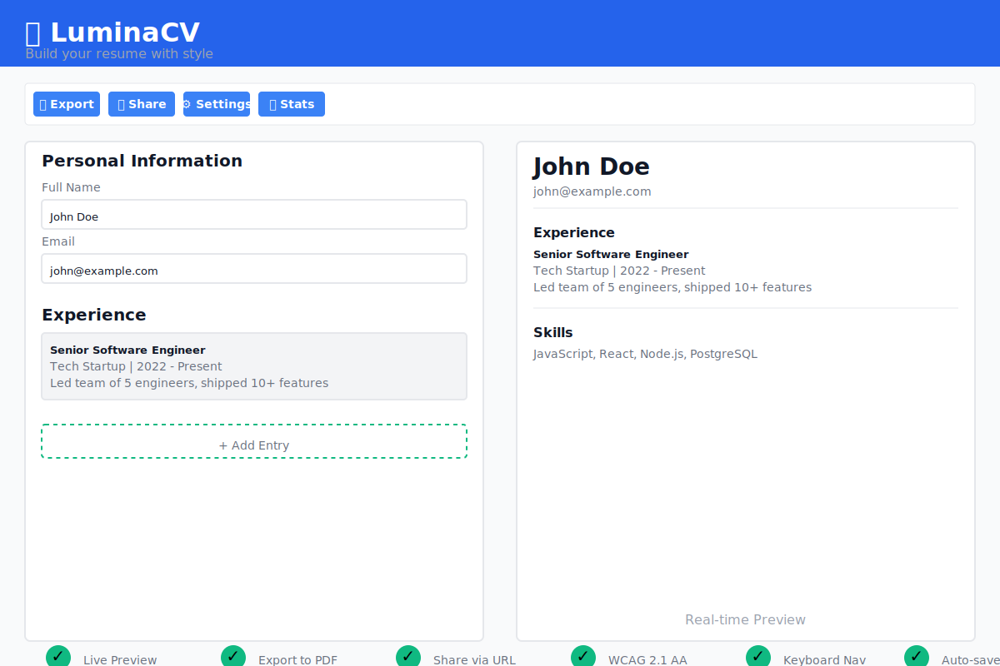

# LuminaCV

Browser-based resume builder. No backend, no accounts.

Edit your resume with live preview. Export to PDF, JSON, or Markdown. Share via URL—data is encoded in the link itself, no server storage.

## Demo

### User Interface


### Full Walkthrough


**Live Application**: https://chiraag-kakar.github.io/luminacv

## Features

- ✅ **Real-time preview** as you type
- ✅ **Export formats** — PDF, JSON, Markdown
- ✅ **URL sharing** with embedded data (no server needed)
- ✅ **Markdown import** — Paste markdown, auto-parse to CV
- ✅ **Text formatting** — Bold, italic, underline, links
- ✅ **localStorage persistence** — Auto-save on changes
- ✅ **Modular architecture** — Clean, maintainable code

## Quick Start

```bash
git clone https://github.com/chiraag-kakar/luminacv.git
cd luminacv
npm install
npm run serve
```

Open `http://localhost:3000/editor.html`

## Development

```bash
npm run build          # Bundle and minify assets
npm test               # Run unit tests
npx playwright test    # Run E2E tests
npm run serve          # Start local server
```

## Features Breakdown

### Core Features
- **Real-time Preview** - Live update as you type
- **Export to PDF** - Browser print dialog
- **Export to JSON** - Complete data backup
- **Export to Markdown** - Version-control friendly format
- **Import from Markdown** - Auto-parse resume files
- **URL Sharing** - No server, data in URL params
- **Auto-save** - 100ms debounced localStorage

### UI/UX
- **5 Resume Sections** - Personal, Experience, Education, Skills, Projects
- **Text Formatting** - Bold, italic, underline, links toolbar
- **4 Templates** - Modern, Classic, Minimal, SWE
- **Customization** - Colors, fonts, backgrounds
- **Statistics** - Word count, character count, section stats
- **Keyboard Shortcuts** - 10+ shortcuts for power users

### Quality
- **WCAG 2.1 Level AA** - Full accessibility compliance
- **Keyboard Navigation** - Tab, Enter, Escape support
- **ARIA Labels** - Screen reader friendly
- **Mobile Responsive** - Works on all devices
- **E2E Tests** - 50+ test cases, multi-browser
- **GitHub Actions** - Auto-test, build, deploy

## Architecture

**Production Mode**: Single bundled `app.js` (107KB) for optimal performance.

```
Development (/js/)          Bundle          Production
─────────────────────    ─────────────    ───────────
15+ modular files    →   node bundle.js  →  app.js
                                              (107KB)
```

**Why bundled?**
- ✅ 1 HTTP request vs 15+
- ✅ No script loading order issues
- ✅ Faster page load
- ✅ Production-ready

**Development workflow:**
```bash
# Edit modular files in /js/
vim js/features/export.js

# Bundle for production
node bundle.js  # or npm run build

# Test
npm run serve
```

**Full details**: See [DOCUMENTATION.md](DOCUMENTATION.md) for:
- Development vs Production modes
- Bundling process step-by-step
- localStorage structure
- Data flow diagrams
- Module dependencies

**Accessibility**: See [ACCESSIBILITY.md](ACCESSIBILITY.md) for WCAG 2.1 Level AA compliance details.

## Export Formats

| Format | Use Case |
|--------|----------|
| **PDF** | Print-ready via browser print |
| **JSON** | Data backup and portability |
| **Markdown** | Version control friendly |

## Sharing

Click "Share" to generate a URL:
```
https://example.com/editor.html?cv=<encoded-data>
```

Recipients see read-only preview. No database—data lives in the URL.

## Development Journey

See the project evolution in git history:

```bash
git log --oneline
```

Each commit represents a complete feature phase, showing how the product was built incrementally.

## License

MIT
